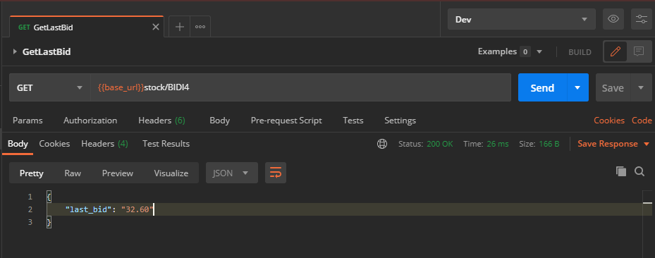
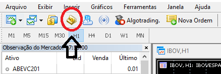
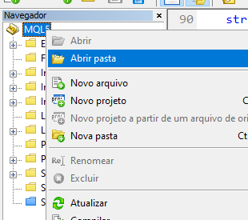

# BolsaAPI

BolsaAPI is a workarround for the lack of reliable brazil stock market API. It create an endpoint to check any brazilian stock price by consulting a MetaTrader bot(Expert Advisor) under the hood. Currently this is a demo project with only last price info, but can be easily improved to cover other stock data by just plugging new functions.

## How It Works

* **BolsaExpAdvisor.mq5** is a mql demo code that creates a socket connection that can receive a stock code and returns its current info (like last bid/ask). Instead of avaiable solutions like **[Google Finance]** that returns the data with a delay of 15 minutes, **BolsaExpAdvisor.mq5** retrieves the info direcly from the stock Exchange without delay.
* **BolsaApi.ipynb** is a demo python code that connects with the BolsaExpAdvisor through sockets to request the latest stock info and expose it as a rest api endpoint using flask.
* **BolsaApiCollection & BolsaApiDevEnv** are postman files (Collection and Environment) to test the system.

[Google Finance]: https://www.google.com/finance

  

  

## Usage

### [MetaTrader 5]

Unfortunatly it isn't very easy to get a MetaTrader account. It is necessary to get a broker account to later retrieve a MetaTrader account related to that broker. I got my account from [Rico broker] which was totally free (the broker account and also the MetaTrader Account). But this is the most boring part.

[MetaTrader 5]: https://www.metatrader5.com/
[Rico broker]: https://www.rico.com.vc/metatrader/

### [Expert Advisor]

After MetaTrader is installed, it is necessay to:
1. Create the the expert advisor and copy the code from **BolsaExpAdvisor.mq5**
2. Import the files located in **/depedencies** into the MetaTrader MQL5 folder

<b>Show instructions</b>

  
  1. Paste the code from **BolsaExpAdvisor.mq5** into the created expert advisor. The expert advisor can be created from within the MetaTrader interface:
  

  
  

  
  2. Rembember to replace the each file into the correct location. You are not supposed to replace anything. The MQL5 folder can  be located here (MetaEditor 5):
  

  
  

  

[Expert Advisor]: https://www.metatrader5.com/en/terminal/help/algotrading/trade_robots_indicators

### [Jupyter Notebook]

For this demo project I have used [Jupyter Notebook], but this is up to you.
The necessaries libs are: 
1. `zmq`
2. `flask_restful`
3. `flask_jsonpify`

Once those libs are installed, it is possible to run the **BolsaApi.ipynb**. It expose the endpoint: `@Get 127.0.0.1:5002/stock/<stock_id>` that returns the current price of the stock_id

<b>Show instructions</b>

     
    $ pip install zmq flask flask-restful flask-jsonpify
   

[Jupyter Notebook]: https://jupyter.org/

### Postman/Browser

Now it possible to use the  `@Get 127.0.0.1:5002/stock/<stock_id>` to retrieve the current price of any brazilian stock
