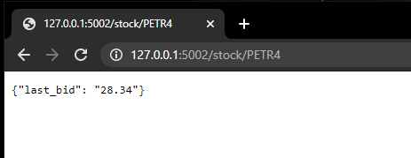

# BolsaAPI

BolsaAPI is a workarround for the lack of reliable brazil stock market API. It create endpoint to check any brazilian stock price by consulting a MetaTrader bot(Expert Advisor) under the hood. Currently this is a demo project with only last price info, but can be easily improved to cover other stock data by just plugging new functions.

## How It Works

* **BolsaExpAdvisor.mq5** is a mql demo code that creates a socket connection that can receive a stock code and returns its current info (like last bid/ask). Instead of avaiable solutions like **[Google Finance]** that returns the data with a delay of 15 minutes, **BolsaExpAdvisor.mq5** retrieves the info direcly from the stock Exchange without delay.
* **BolsaApi.ipynb** is a demo python code that connects with the BolsaExpAdvisor through sockets to request the latest stock info and expose it as a rest api endpoint using flask.
* **BolsaApiCollection & BolsaApiDevEnv** are postman files (Collection and Environment) to test the system.

[Google Finance]: https://www.google.com/finance

  

  

## Usage

### [MetaTrader 5]

Unfortunatly it isn't very easy to get a free account. It is necessary to get a broker account to later retrieve a MetaTrader account realted to that broker. I got my account from [Rico broker] which was totally free (the broker account and also the MetaTrader Account). But this is the most boring part.

[MetaTrader 5]: https://www.metatrader5.com/
[Rico broker]: https://www.rico.com.vc/metatrader/

### [Expoert Advisor]

[Expoert Advisor]: https://www.metatrader5.com/en/terminal/help/algotrading/trade_robots_indicators
